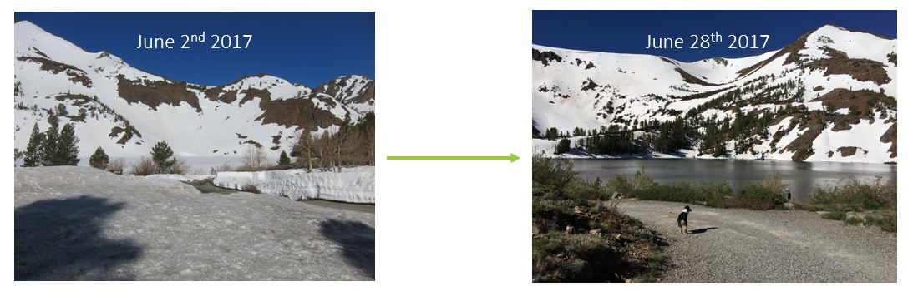

```{r setup, include=FALSE}

library(flexdashboard)
knitr::opts_chunk$set(echo = FALSE, warning=FALSE)
knitr::opts_knit$set(root.dir = normalizePath("../"))

```

# Projects

##  Overview {.sidebar}

### Overview

My research is broadly focused on how climate change will affect an organism's ability to adapt to their envrionment, and more specifcially focused on how movement into more suitable environments is a solution organisms might utalize. To examine these ideas, I have developed projects that look at avian movement ecology and biogeography in the Great Basin. By looking at patterns in avian abundance both temporatlly and spatially, I hope to better understand how climate change will impact avian communities into the future. 


Row {data-height=350}
-----------------------------------------------------------------------

#### Background

The Great Basin is home to over 300 species of breeding birds. My lab group has been surveying sites in the Great Basin since 2001. We have collected data on avian occupancy and abundance, vegetation, nest sites, and more recently for my dissertation work microclimate and insect biomass. Because we visit each location three times per season and survey for birds, I was able to create models that examined how the avian community changes throughout the breeding season. Check out the Map tab to look at our sites! 

#### Within-season dispersal

A dominant paradigm in ornithology is that birds arrive on their breeding grounds, establish a territory, and remain there until it is time to molt or migrate. However, during my five field seasons in the Great Basin I started to notice that for some species, something else might be going on. I consistently saw some species of birds at lower elevations in the beginning of the breeding season, and higher elevations later in the breeding season. Are some species switching territories during their breeding season? Why are some species moving and others not? Why might within season movement occur? I decided to build some models that would help answer those questions. Check out the Within-Season Dispersal tab for more info on this project. 

#### Elevation Range Shifts 

How do birds respond to climate change? Because birds are a highly vagile species, it is thought that one of the main ways bird are responding is through movement to more suitable habitats. Is climate change driving avian movements at our Great Basin sites? 

This project aims to examine if elevational range shifts, or perhaps more accurately population-level shifts, are occurring at our Great Basin sites. Because we have a long term data set going back to 2002, I will be able to determine if species of birds have shifted elevationally in response to increasing temperature or changing precipitation regimes in a ~20 year period. If climate change is responsible for shifting species' ranges, it could have big consequences for conservation of these species into the future. 

#### Data Collection

What sort of data are we collecting to answer these questions? All sorts! 

  + Avian occupancy and abundance
  + Vegetational composition of sites
  + Nest sites for specific species (dissertation work of Frank Fogarty)
  + Microclimate using HOBO data loggers
  + Insect biomass using sticky traps and malaise traps
  + Phenology of plant species known to be part of passerine diet
  
Through this data collection and statistical models, I hope to influence avian conservation decisions in the Great Basin, and examine current conservation practices in the context of passerine species.


# Map 

## Mapping {.sidebar}

### Spatial Data

Avian sampling through point count surveys has occurred at multiple locations throughout the Great Basin. Zoom in to see site where I have collected data on microclimate, plant phenology, and insect biomass. 

Row
-------------------------------------

#### Sampling locations for dissertation research 

```{r echo=F, warning=F, message=F, fig.width=10, fig.height=6.5}

library(sf)
library(raster)
library(leaflet)
library(dplyr)

setwd("../marthazillig.github.io/marthazillig.github.io")

bug2 <- read.csv("rmd_files/logger_insect_2018.csv")
bird2 <- read.csv("rmd_files/bird_lat_long2.csv")
plant2 <- read.csv("rmd_files/plants_lat_long2.csv")

names(bug2)[names(bug2) == 'ï..logger'] <- 'location_id'
names(bird2)[names(bird2) == 'ï..trap_number'] <- 'location_id'
names(plant2)[names(plant2) == 'ï..trap_number'] <- 'location_id'

#adding in central points
central<- read.csv("rmd_files/central_utm.csv")

central<- plyr::rename(central, c("ï..point" = "point"))

central2<-central %>% 
  select(UTMx, UTMy)

library(rgdal)
utm <- SpatialPoints(central2, proj4string=CRS("+proj=utm +zone=11 +datum=WGS84")) 

geo <- spTransform(utm, CRS("+proj=longlat +datum=WGS84"))

c_geo <- as.data.frame(geo)

#adding Utah points
utah<- read.csv("rmd_files/Utah_survey_locations.csv")
utah<- plyr::rename(utah, c("ï..range" = "range"))

utah2<-utah %>% 
  select(UTMx, UTMy)

utah2<- na.omit(utah2) #get rid of all nas (5 rows deleated )

utm_u <- SpatialPoints(utah2, proj4string=CRS("+proj=utm +zone=12 +datum=WGS84")) #utah is zone 12

geo_u <- spTransform(utm_u, CRS("+proj=longlat +datum=WGS84"))

utah_points <- as.data.frame(geo_u)

#idaho

idaho <- read.csv("rmd_files/idaho_points.csv")
idaho <- plyr::rename(idaho, c("ï..canyon" = "canyon"))

idaho2<-idaho %>% 
  select(UTMx, UTMy)

idaho2<- na.omit(idaho2) #get rid of all nas (5 rows deleated )

utm_i <- SpatialPoints(idaho2, proj4string=CRS("+proj=utm +zone=11 +datum=WGS84"))

geo_i <- spTransform(utm_i, CRS("+proj=longlat +datum=WGS84"))

idaho_points <- as.data.frame(geo_i)


#states and GB outline
states <- sf::st_read("rmd_files/shapes/cb_2016_us_state_20m.shp", quiet = TRUE)

states2 <- st_transform(states, 4326)

greatbasin <- sf::st_read("rmd_files/shapes/GreatBasin_LCC.shp", quiet = TRUE)
greatbasin2 <- st_transform(greatbasin, 4326)

#color pallet

#install.packages("RcColorBrewer")
library(RColorBrewer)

mapcol <- brewer.pal(3, "Set2")


####Map         #Plant phenology 2018 locations still need to be added 


leaflet() %>% 
  addTiles() %>% 
  setView(lng = -117, lat = 39, zoom = 6) %>%
  addProviderTiles(providers$Esri.WorldPhysical) %>% 
  
  
  #Insect data
  
  addCircleMarkers(data = bug2, group = "Insect Biomass + Microclimate", lat=~long, lng=~lat, 
                   opacity= .5, stroke = TRUE,
                   popup=paste0 ("Canyon: ", bug2$canyon, ", ",
                                 "Trap Number: ", bug2$location_id, ", "), 
                   weight=0.6,radius=10, fillColor = mapcol[1]) %>% 
  hideGroup("Insect Biomass + Microclimate") %>% 
  
  #Plant data
  
  addCircleMarkers(data = plant2, group = "Plant Phenology", lat=~lat, lng=~long, opacity = .5,
                   popup=paste0 ("Canyon: ", plant2$canyon, ", ",
                                 "Phenology Point: ", plant2$location_id, " "),
                   weight=0.6,radius=10, stroke=TRUE, fillColor = mapcol[2]) %>% 
  hideGroup("Plant Phenology") %>% 
  
  #bird data
  
  addCircleMarkers(data = bird2, group = "Bird Survey", lat=~lat, lng=~long, opacity = .5, 
                   popup=paste0("Canyon: ", bird2$canyon, ", ",
                                "Survey Point: ", bird2$location_id, " "),
                   weight=0.6,radius=10, stroke=TRUE, fillColor = mapcol[3]) %>% 
  hideGroup("Bird Survey") %>% 
  
  #central bird points
  addCircleMarkers(data=c_geo, group = "Bird Survey", lat=~UTMy, lng = ~UTMx, opacity = .5, 
                   weight=0.6,radius=10, stroke=TRUE, fillColor = mapcol[3]) %>% 
  
  #utah and idaho bird points
  addCircleMarkers(data=utah_points, group = "Bird Survey", lat=~UTMy, lng = ~UTMx, opacity = .5, 
                   weight=0.6,radius=10, stroke=TRUE, fillColor = mapcol[3]) %>% 

  addCircleMarkers(data=idaho_points, group = "Bird Survey", lat=~UTMy, lng = ~UTMx, opacity = .5, 
                   weight=0.6,radius=10, stroke=TRUE, fillColor = mapcol[3]) %>% 
  
  #add states and gb shapes
  addPolygons(data = states2, color = "black", weight = 1.5, fillColor = "transparent") %>% 
  addPolygons(data = greatbasin2, color = "black", weight = 4, fillColor = "transparent") %>% 
  
  addLayersControl(
    overlayGroups = c("Bird Survey", "Insect Biomass + Microclimate", "Plant Phenology"),
    options = layersControlOptions(collapsed = F))

```

# Within Season Dispersal  

## Example {.sidebar}

### Within Season Elevational Dispersal

By building statistical models that examine changes in where birds actually are at different time points in the breeding season, I was able to determine that at least six species of bird are moving elevationally within the breeding season. Why are these birds moving and others are not? Why is driving that movement? 

I tested a total of 25 bird species in the western and central Great Basin sites. Of those 25, I found that 6 species were moving elevationally within their breeding season. Check out the tabs below to view figures that illustrate how site availability (a bird actually using a site) changes both elevationally and temporally (Visit 1 = earliest in the season, Visit 2 = latest in the season)

Row
---------------------------------------------------------------------------

### Why move? 

There are multiple hypotheses about why a bird would switch terriroties within its breeding season. At our sites, I believe within season dispersal is linked to environmental heterogenetiy. Environmental heterogeneity means that resources are dispersed across a landscape both spatially and temporally. The environmental heterogenetiy hypothesis posits that an individual bird might switch nest sites for a second brood or after an unsucessful nest to take advantage of more/better resources somwhere else. 

Working in sites with big elevational gradients has allowed me to test this hypothesis. Elevation plays a big role in when in the season a single site will have enough resources for nesting birds. Check out the two pictures below. They are from one of our sites in the western Great Basin, taken just a few weeks apart. In the first picture, taken early in the breeding season, this site is not suitable for most species of birds to nest in. However, just a few weeks later, all the snow has melted and plants are quickly greening up. Could these differences in resource phenology at different elevations drive avian movements? 




Row {.tabset .tabset-fade .tabset-pills}
--------------------------------------------------------------

```{r global, include=FALSE}

setwd("../marthazillig.github.io/marthazillig.github.io")


library(tidyverse)

slope_data <- read_csv("/Users/Martha Wohlfeil/Desktop/GitHub Files/marthazillig.github.io/marthazillig.github.io/rmd_files/species_slopes.csv")

```


### <small>Vesper Sparrow</small>

Vesper Sparrows move **upslope** in the central Great Basin within the breeding season 

```{r}
library(cowplot)
library(tidyverse)


VESP<- slope_data %>% 
  filter(Species == "Vesper_Sparrow")

v1_vesp <- ggplot() + 
   geom_abline(slope = VESP$V1, intercept = 0) +xlim(0, 3) + ylim(0, 3) + ggtitle("Visit 1") + xlab("Elevation") + ylab("Site Use") +  theme_bw() + theme(plot.title = element_text(hjust = 0.5))

v2_vesp <- ggplot() + 
   geom_abline(slope = VESP$V2, intercept = 0) +xlim(0, 3) + ylim(0, 3) + ggtitle("Visit 2") + xlab("Elevation") + ylab("Site Use") +  theme_bw() + theme(plot.title = element_text(hjust = 0.5))

v3_vesp <- ggplot() + 
   geom_abline(slope = VESP$V3, intercept = 0) +xlim(0, 3) + ylim(0, 3) + ggtitle("Visit 3") + xlab("Elevation") + ylab("Site Use") +  theme_bw() + theme(plot.title = element_text(hjust = 0.5))

vesp_pic <- ggdraw()+ draw_image("marthazillig.github.io/img/brsp.jpg", scale = 0.8)

cowplot::plot_grid(v1_vesp, v2_vesp, v3_vesp, NULL, vesp_pic, ncol = 3, nrow =2)

```


### <small>Green-Tailed Towhee</small>

Green-tailed Towhees move **downslope** in the western Great Basin within the breeding season. 


```{r}


GTTO <- slope_data %>% 
  filter(Species == "Green-tailed_Towhee")

v1_gtto <- ggplot() + 
   geom_abline(slope = GTTO$V1, intercept = 0) +xlim(0, 3) + ylim(-2, 0) + ggtitle("Visit 1") + xlab("Elevation") + ylab("Site Use") +  theme_bw() + theme(plot.title = element_text(hjust = 0.5))

v2_gtto <- ggplot() + 
   geom_abline(slope = GTTO$V2, intercept = 0) +xlim(0, 3) + ylim(-2,0) + ggtitle("Visit 2") + xlab("Elevation") + ylab("Site Use") +  theme_bw() + theme(plot.title = element_text(hjust = 0.5))

v3_gtto <- ggplot() + 
   geom_abline(slope = GTTO$V3, intercept = 0) +xlim(0, 3) + ylim(-2,0) + ggtitle("Visit 3") + xlab("Elevation") + ylab("Site Use") +  theme_bw() + theme(plot.title = element_text(hjust = 0.5))

gtto_pic <- ggdraw()+ draw_image("marthazillig.github.io/img/gtto.jpg", scale = 0.8)

plot_grid(v1_gtto, v2_gtto, v3_gtto, NULL, gtto_pic, ncol = 3, nrow =2)

```

### <small>Broad-tailed Hummingbird</small>

Broad-tailed Hummingbirds move **upslope** in the central Great Basin within the breeding season 

```{r}

BTAH <- slope_data %>% 
  filter(Species == "Broad-tailed_Hummingbird")

v1_btah <- ggplot() + 
   geom_abline(slope = BTAH$V1, intercept = 0) +xlim(0, 3) + ylim(0,3) + ggtitle("Visit 1") + xlab("Elevation") + ylab("Site Use") +  theme_bw() + theme(plot.title = element_text(hjust = 0.5))

v2_btah <- ggplot() + 
   geom_abline(slope = BTAH$V2, intercept = 0) +xlim(0, 3) + ylim(0,3) + ggtitle("Visit 2") + xlab("Elevation") + ylab("Site Use") +  theme_bw() + theme(plot.title = element_text(hjust = 0.5))

v3_btah <- ggplot() + 
   geom_abline(slope = BTAH$V3, intercept = 0) +xlim(0, 3) + ylim(0,3) + ggtitle("Visit 3") + xlab("Elevation") + ylab("Site Use") +  theme_bw() + theme(plot.title = element_text(hjust = 0.5))

btah_pic <- ggdraw()+ draw_image("marthazillig.github.io/img/btah.jpg", scale = 0.8)

plot_grid(v1_btah, v2_btah, v3_btah, NULL, btah_pic, ncol = 3, nrow =2)

```

### <small>MacGillivray's Warbler</small>

In both the western and central Great Basin, MacGillivray's Warblers move **upslope** within the breeding season. This figure is the slopes of the western Great Basin model output. 
```{r}


MGWA <- slope_data %>% 
  filter(Species == "MacGillivray's_Warbler") %>% 
  filter(Region == "Western")

v1_mgwa <- ggplot() + 
   geom_abline(slope = MGWA$V1, intercept = 0) +xlim(0, 3) + ylim(0,3) + ggtitle("Visit 1") + xlab("Elevation") + ylab("Site Use") +  theme_bw() + theme(plot.title = element_text(hjust = 0.5))

v2_mgwa <- ggplot() + 
   geom_abline(slope = MGWA$V2, intercept = 0) +xlim(0, 3) + ylim(0,3) + ggtitle("Visit 2") + xlab("Elevation") + ylab("Site Use") +  theme_bw() + theme(plot.title = element_text(hjust = 0.5))

v3_mgwa <- ggplot() + 
   geom_abline(slope = MGWA$V3, intercept = 0) +xlim(0, 3) + ylim(0,3) + ggtitle("Visit 3") + xlab("Elevation") + ylab("Site Use") +  theme_bw() + theme(plot.title = element_text(hjust = 0.5))

mgwa_pic <- ggdraw()+ draw_image("marthazillig.github.io/img/mgwa.jpg", scale = 0.8)

plot_grid(v1_mgwa, v2_mgwa, v3_mgwa, NULL, mgwa_pic, ncol = 3, nrow =2)

```

### <small>Brewer's Sparrow</small>

Brewer's Sparrows move **upslope** within the breeding season in the western Great Basin 

```{r}


BRSP <- slope_data %>% 
  filter(Species == "Brewer's_Sparrow")

v1_brsp <- ggplot() + 
   geom_abline(slope = BRSP$V1, intercept = 0) +xlim(0, 3) + ylim(0,3) + ggtitle("Visit 1") + xlab("Elevation") + ylab("Site Use") +  theme_bw() + theme(plot.title = element_text(hjust = 0.5))

v2_brsp <- ggplot() + 
   geom_abline(slope = BRSP$V2, intercept = 0) +xlim(0, 3) + ylim(0,3) + ggtitle("Visit 2") + xlab("Elevation") + ylab("Site Use") +  theme_bw() + theme(plot.title = element_text(hjust = 0.5))

v3_brsp <- ggplot() + 
   geom_abline(slope = BRSP$V3, intercept = 0) +xlim(0, 3) + ylim(0,3) + ggtitle("Visit 3") + xlab("Elevation") + ylab("Site Use") +  theme_bw() + theme(plot.title = element_text(hjust = 0.5))

brsp_pic <- ggdraw()+ draw_image("marthazillig.github.io/img/brsp2.jpg", scale = 0.8)

plot_grid(v1_brsp, v2_brsp, v3_brsp, NULL, brsp_pic, ncol = 3, nrow =2)

```

### <small>Yellow Warbler</small>

Yellow Warblers move **upslope** within the breeding season in the central Great Basin. 

```{r}


YEWA <- slope_data %>% 
  filter(Species == "Yellow_Warbler") 

v1_yewa <- ggplot() + 
   geom_abline(slope = YEWA$V1, intercept = 0) +xlim(0, 3) + ylim(0,3) + ggtitle("Visit 1") + xlab("Elevation") + ylab("Site Use") +  theme_bw() + theme(plot.title = element_text(hjust = 0.5))

v2_yewa <- ggplot() + 
   geom_abline(slope = YEWA$V2, intercept = 0) +xlim(0, 3) + ylim(0,3) + ggtitle("Visit 2") + xlab("Elevation") + ylab("Site Use") +  theme_bw() + theme(plot.title = element_text(hjust = 0.5))

v3_yewa <- ggplot() + 
   geom_abline(slope = YEWA$V3, intercept = 0) +xlim(0, 3) + ylim(0,3) + ggtitle("Visit 3") + xlab("Elevation") + ylab("Site Use") +  theme_bw() + theme(plot.title = element_text(hjust = 0.5))

yewa_pic <- ggdraw()+ draw_image("marthazillig.github.io/img/yewa.jpg", scale = 0.8)

plot_grid(v1_yewa, v2_yewa, v3_yewa, NULL, yewa_pic, ncol = 3, nrow =2)

```